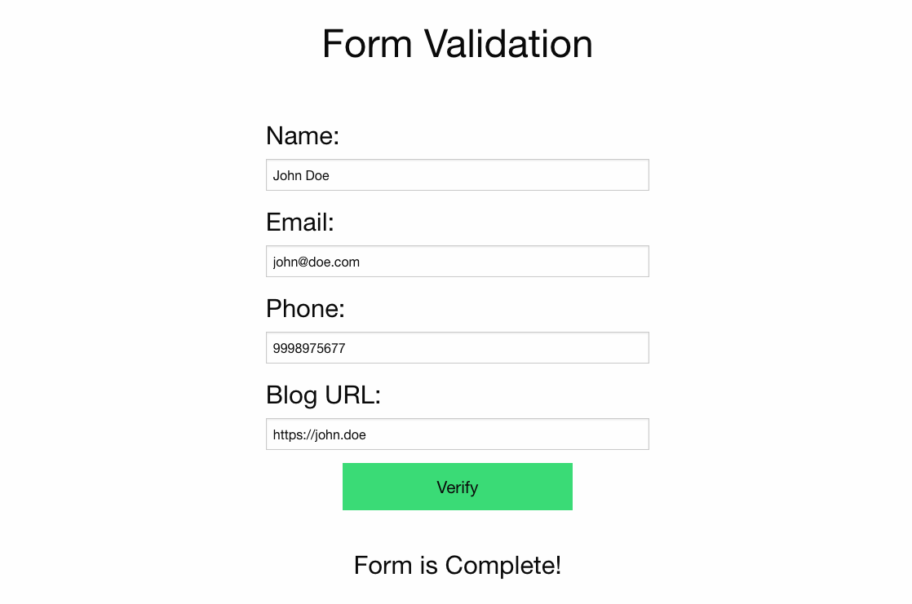
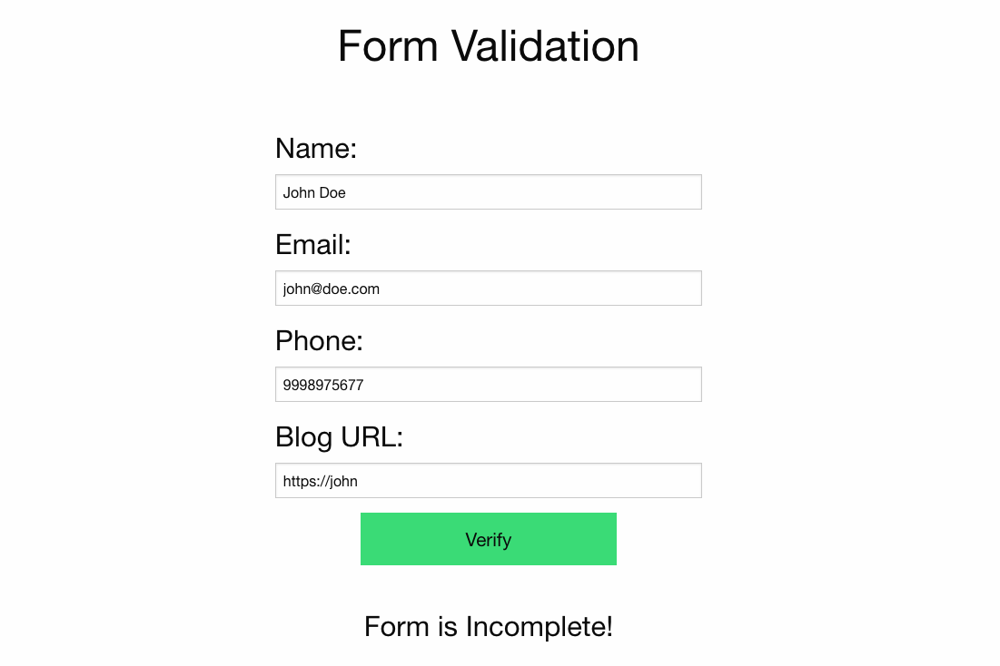

# Extra-Project - Form Validation
## single page React application 
This page contennt validates input fields of a form. 

**The form contains four fields:**
* **Name**: its accept upper and lower case English alphabetic letters and space only.the name length between 3 and 30
* **E-mail**: A standard email address. For example, `user@domain.extension `
* **Phone**: A 10-digit number that does not begin with 0 or 1 (US standard)
* **Blog URL**: A standard URL for example `http://domain.com` , `http://www.domain.net` or `domain.cc`
\
\
  Model of implementation

